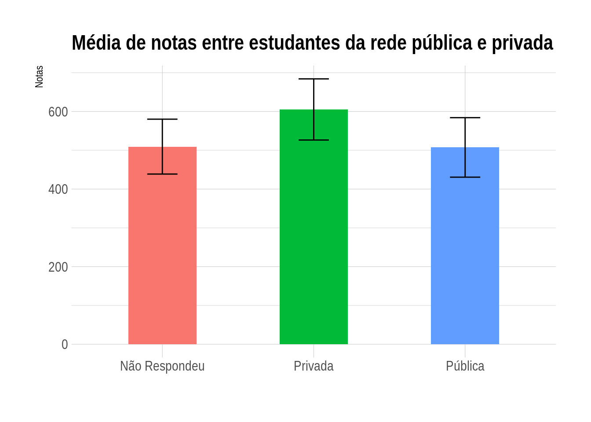

# Exame Nacional do Ensino Médio (ENEM)
Instiuído em 1998 e aplicado como mecanismo de acesso à educação superior a partir de 2009, o ENEM é uma das principais formas de avaliar o conhecimento dos estudantes brasileiros. A partir dos microdados do ENEM disponibilizados pelo INEP é possível avaliar o desempenho geral dos estudantes brasileiros nas diferentes áreas do conhecimento e também fazer uma intersecção desses dados com as informações disponíveis nos questinários socioecômicos também presentes nos microdados.

Essas informações são de extrema relevância para uma maior compreensão sobre a educação brasileira de jovens e adultos. Os dados espelham a realidade do ensino brasileiro em seus diferentes aspectos sociais, econômicos e raciais. 

# Análise de Microdados ENEM
> Fonte dos microdados: https://www.gov.br/inep/pt-br/acesso-a-informacao/dados-abertos/microdados/enem

# Etapa 1: Tratamento dos dados
Foram coletados microdados do ENEM do ano de 2019, os dados vieram em formato CSV (Comma-Separated Values) separados por " ; " e em codificação "latin1". A tabela com os microdados é chamada de "MICRODADOS_ENEM_2019.csv" e possui, quando descompactada, 2.2 GB de tamanho. Para o tratamento dos dados foi utilizado o software RStudio, essa escolha se deu pela melhor manipulação de arquivos grandes pelo software. 

O tratamento dos dados foi guiado pelo arquivo [Planejamento da análise](https://github.com/gabrielvpina/analise_microdados_ENEM_2019/blob/main/Planejamento_da_analise.md), onde as perguntas que nós queremos responder determinaram quais dados foram preservados e quais foram descartados.

Após rodar o script [Tratamento de dados](https://github.com/gabrielvpina/analise_microdados_ENEM_2019/blob/main/tratamento_de_dados.R) vamos obter o arquivo "microdados_filtrados.csv" com somente a informação necessária para responder nossas perguntas. Observe que o arquivo final é bem menor em tamanho que o inicial, o que facilita seu manuseio.


Logo após o tratamento dos dados foi necessário retirar os candidatos que não participaram das provas. Esses participantes continham os campos com as notas nas provas em branco (no caso do RStudio, sinalizados com "NA" nas células nulas). Para a retirada dos dados faltantes, foi ultilizado o seguinte código:


```
# Microdados sem NAs

microdados_sem_NA <- na.omit(microdados_filtrados)

# Exportar microdados sem NAs 

write.csv(microdados_sem_NA,"DADOS/microdados_sem_NA.csv", row.names = FALSE)

```

Assim nós criamos um novo arquivo CSV chamado "microdados_sem_NA.csv" na nossa pasta DADOS.

# Etapa 2: Análise de dados

A partir desse arquivo, foi criado o script [análise dos dados](https://github.com/gabrielvpina/analise_microdados_ENEM_2019/blob/main/analise_dos_dados.R) a fim de responder as perguntas que direcionaram o nosso planejamento da análise. Os dados obtidos através desse script foram armazenados em um arquivo do tipo R Markdown (RMD), e logo após convertidos para o formato HTML. 

O arquivo [Resultados e Insights](https://github.com/gabrielvpina/analise_microdados_ENEM_2019/blob/main/Resultados-e-Insights.html) é um relatório dos dados brutos que direcionaram a nossa análise. Nele estão contidos os gráficos e tabelas contendo os resultados da nossa análise. Será a partir dos dados observados nesse relatório que iremos confeccionar um dashboard priorizando somente as informações mais relevantes e os pontos de destaque na nossa análise.

É importante ressaltar que os gráficos desse relatório inicial foram feitos a partir da linguagem R, como o exemplo abaixo. A criação do dashboard final irá ultilizar a mesma base de dados usada na criação dos gráficos pelo R.




