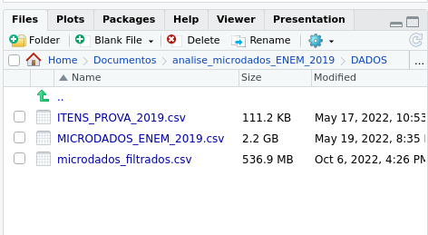

# Lista de conteúdos
- [Análise de Microdados ENEM](Análise de Microdados ENEM)
- [Etapa 1: Tratamento dos dados](Etapa 1: Tratamento dos dados)

# Análise de Microdados ENEM
> Fonte dos microdados: https://www.gov.br/inep/pt-br/acesso-a-informacao/dados-abertos/microdados/enem

# Etapa 1: Tratamento dos dados
Foram coletados microdados do ENEM do ano de 2019, os dados vieram em formato CSV (Comma-Separated Values) separados por " ; " e em codificação "latin1". A tabela com os microdados é chamada de "MICRODADOS_ENEM_2019.csv" e possui, quando descompactada, 2.2 GB de tamanho. Para o tratamento dos dados foi utilizado o software RStudio, essa escolha se deu pela melhor manipulação de arquivos grandes pelo software. 

O tratamento dos dados foi guiado pelo arquivo [Planejamento da análise](https://github.com/gabrielvpina/analise_microdados_ENEM_2019/blob/main/Planejamento_da_analise.md), onde as perguntas que nós queremos responder irão determinar quais dados vamos preservar e quais vamos descartar.

Após rodar o script [Tratamento de dados](https://github.com/gabrielvpina/analise_microdados_ENEM_2019/blob/main/tratamento_de_dados.R) vamos obter o arquivo "microdados_filtrados.csv" com somente a informação necessária para responder nossas perguntas. Observe que o arquivo final é bem menor em tamanho que o inicial, o que facilita seu manuseio.

